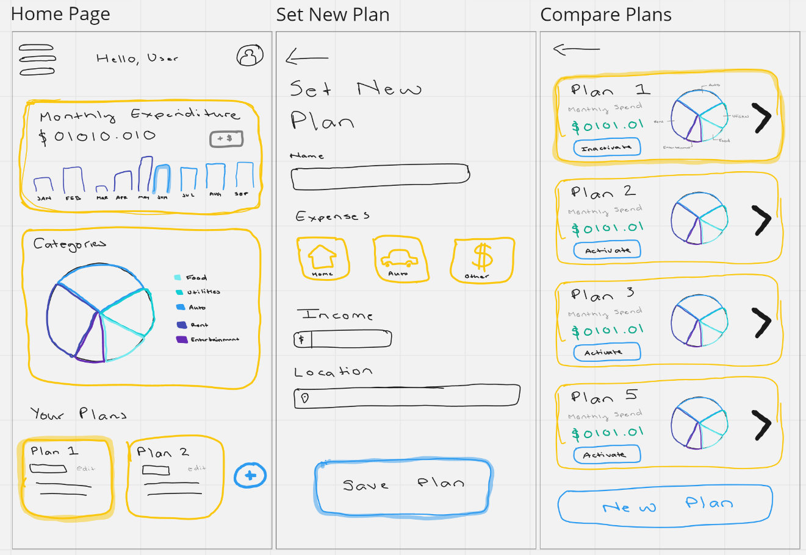
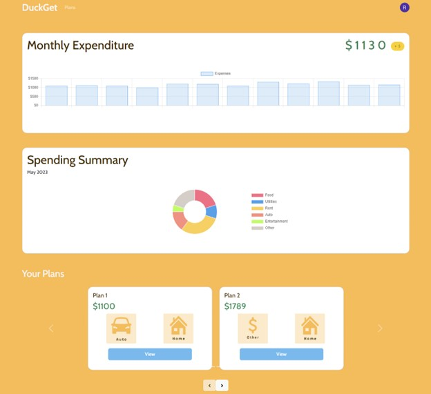
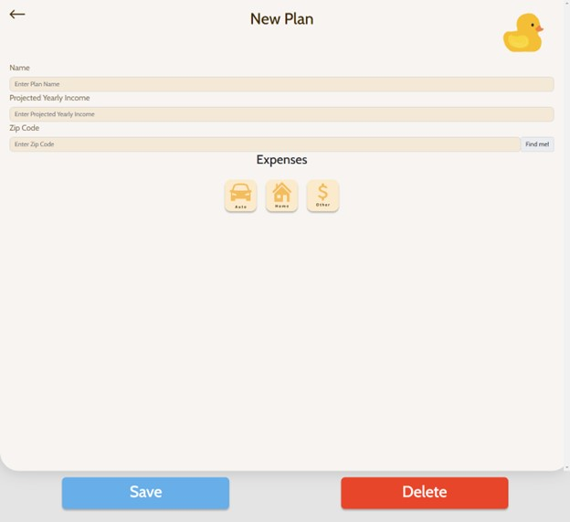
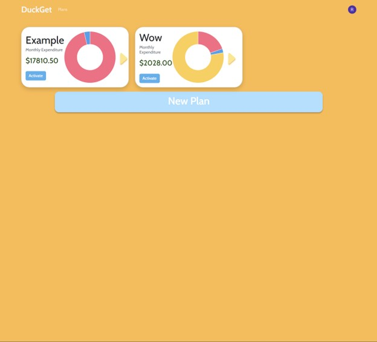

# Module 2 Group Assignment

CSCI 5117, Spring 2022, [assignment description](https://canvas.umn.edu/courses/355584/pages/project-2)

## App Info:

* Team Name: Code Titans
* App Name: DuckGet
* App Link: <https://duckget.netlify.app/>

### Students

* Infant Derrick Gnana Susairaj, gnana014@umn.edu
* Jeevan Prakash, praka066@umn.edu 
* Kailash Kalyanasundaram, kalya023@umn.edu
* Rohan Shanbhag, shanb020@umn.edu

## Key Features

**Describe the most challenging features you implemented
(one sentence per bullet, maximum 4 bullets):**

* Connecting the database to the various different endpoints for different budgeting information of DuckGet
* Installing a nextJS application as a PWA proved to be tricky with the browser service workers not cooperating
* Rendering all the calculations for auto, home and other expenses
* Creating a database schema to fit all the requirements of the budgeting app

Which (if any) device integration(s) does your app support?

* Geolocation to get the user's nearset zipcode for differing state taxes/rates.

Which (if any) progressive web app feature(s) does your app support?

* Installing a PWA feature. From the web browser, we can install the DuckGet app into a mobile-friendly PWA version

## Mockup images

### Low-Fidelity Diagram

#### Home Page
The home page highlights the user's Monthly Expenditure, Spending Summary and any spending plans that the user might be following, also allowing them to navigate to each of these pages easily.

#### Set New Plan Page
The set new plan Page allows users to set up a new personal budget plan. The user can input income, location, expenses, and a descriptive name of this plan.

#### Compare Plans Page
The compare plans page will greet the user with a few pre-made budget plan suggestions, but will also allow them to create and customize a plan unique to them depending on their specific preferences.

**Todo**

### High-Fidelity Diagram

Here is a high-fidelity version of our project that we also created for reference. We are not bound to this design but this may provide some guidance for us as we design our project.

## Testing Notes

**Is there anything special we need to know in order to effectively test your app? (optional):**

* ...

## Screenshots of Site (complete)

**[Add a screenshot of each key page](https://stackoverflow.com/questions/10189356/how-to-add-screenshot-to-readmes-in-github-repository)
along with a very brief caption:**

## External Dependencies

**Document integrations with 3rd Party code or services here.
Please do not document required libraries (e.g., Vue, Vuefire, Firebase).**

* GCP: For Car API data storage
* Api Ninjas API- API to get Car, Location , Sales and Mortgage Tax information
* NHTSA API - API for car lookup and more specific auto information
* next-pwa: For installing a PWA

**If there's anything else you would like to disclose about how your project
relied on external code, expertise, or anything else, please disclose that
here:**

...
